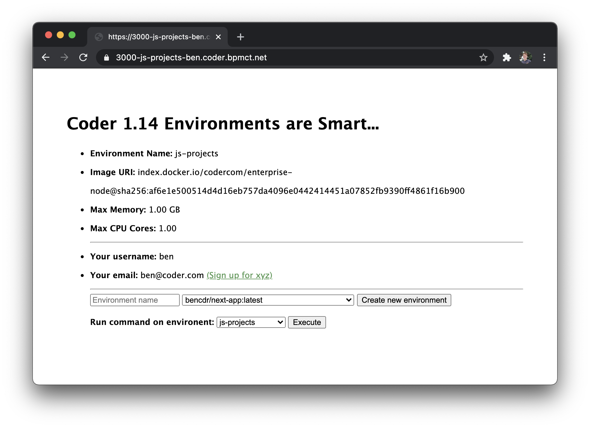

# environment automation

An express app that uses built-in features from [Coder environments](https://coder.com/docs/environments) and [coder-cli](https://github.com/cdr/coder-cli) to do some cool automated stuff outside of Coder's main Ui.

## Architecture

This is just a simple express app with Pug view engine. Here's what's important to understand in this demo app:

`app.js` - controlls routes (nothing special to Coder)

`routes/index.js` - uses env variables and coder-cli to get info about:
- the current environment (env vars)
- all Coder environments by the environment owner
- all Coder images

`views/index.pug` - renders the index page and displays the Coder info

## Getting started

Ideally, this is installed in a Coder environment.
- [CODER Environment variables](https://help.coder.com/hc/en-us/articles/360059484653-Working-with-CODER-Environment-Variables) will be injected for context on the Coder environment/user.
- coder-cli will already be installed

However, the create/command exec functionality could work on any system with coder-cli installed.

1. [If using Coder]: Use an image with Node installed. We recommend [codercom/enterprise-node:ubuntu](https://hub.docker.com/r/codercom/enterprise-node) in the Docker Hub.
2. Clone this repo
3. `npm install`
4. To run the web app, `npm start`
5. [If using Coder]: Open a [Dev URL](https://coder.com/docs/environments/devurls) on port 3000 to access the web app.